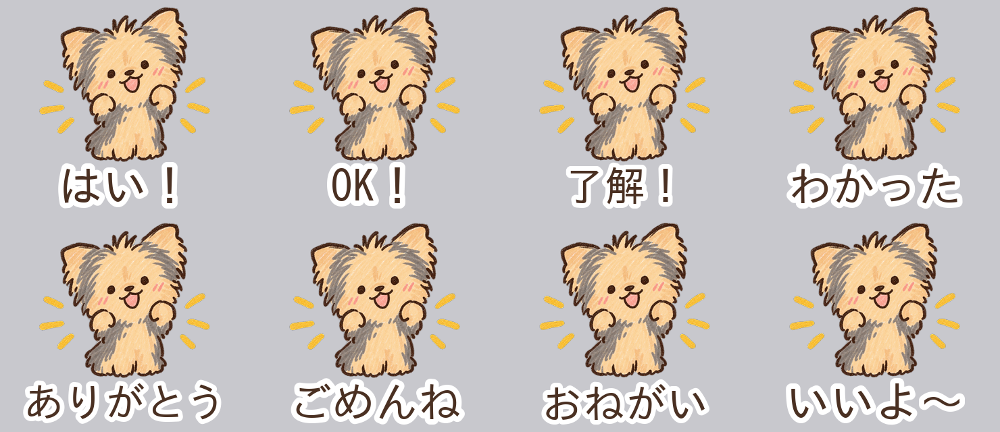

# kuro スタンプ制作キット

ヨークシャーテリアの「kuro」で、**シンプルな返事・相槌のLINEスタンプ**を作るための一式です。
Gemini用のプロンプト（4セット×16個＝64個）と、
切り抜き〜提出用ZIP作成まで自動でやるスクリプトが入っています。



## 4セットの構成

| セット | テーマ | 中身 | プロンプト |
|---|---|---|---|
| **A** | ベーシック返事 | はい／OK／了解／ありがとう／ごめんね／まかせて 他 | [set-a](prompts/set-a_basic-reply.md) |
| **B** | ていねい・敬語 | 承知しました／お疲れ様です／申し訳ありません 他 | [set-b](prompts/set-b_polite.md) |
| **C** | 相槌・リアクション | うんうん／なるほど／たしかに／すごい！／えー！ 他 | [set-c](prompts/set-c_aizuchi.md) |
| **D** | 毎日のひとこと | おはよう／おやすみ／ただいま／いまどこ？ 他 | [set-d](prompts/set-d_daily.md) |

各16個。LINEの規定（8/16/24/32/40個）に合っていて、**Aセットから1つずつ出す**のがおすすめです。

## 使い方（4ステップ）

```bash
pip install -r scripts/requirements.txt

# 1. prompts/set-a_basic-reply.md のプロンプトをGeminiに貼り、
#    reference/character.png を添付して16枚生成 → work/raw/A-01.png … A-16.png に保存

# 2. 白背景を透過にして 370x320 に整える
python3 scripts/stickerkit.py cutout --set A

# 3. セリフを焼き込む（Geminiに文字を描かせない場合）
python3 scripts/stickerkit.py text --set A

# 4. 提出用ZIPを作る（01.png〜16.png + main.png + tab.png）
python3 scripts/stickerkit.py package --set A
python3 scripts/stickerkit.py check dist/kuro-stickers-A.zip
```

詳しい手順は **[docs/workflow.md](docs/workflow.md)**、
LINEの規定と審査の注意点は **[docs/line-spec.md](docs/line-spec.md)** を見てください。

## 文字（セリフ）について

画像生成AIは日本語を崩しがちなので、**絵は文字なしで作って、セリフは `text` コマンドで合成**する
作りにしています。Geminiに文字ごと描かせたい場合は、各プロンプトの最後の行を差し替えてください
（詳細は [prompts/README.md](prompts/README.md)）。

## フォルダ

```
reference/character.png   キャラの参考画像（Geminiに毎回添付する）
prompts/                  Gemini用プロンプト集（prompts.json が元データ）
scripts/stickerkit.py     切り抜き / セリフ合成 / ZIP作成 / 規定チェック
scripts/gen_prompts.py    prompts.json → Markdown のプロンプト集を再生成
work/raw                  Geminiで作った元画像を置く場所
work/cutout               切り抜き済み（370x320・透過）
work/final                セリフ合成済み
dist/                     提出用ZIP
```
